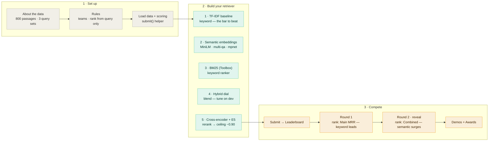
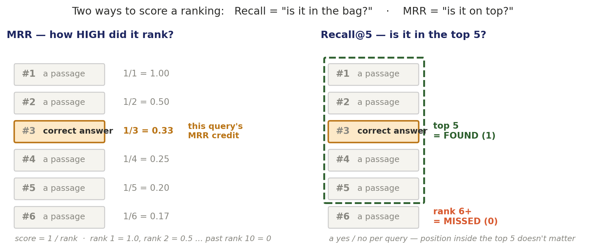

# The Retrieval Hackathon — Meaning vs. Words

**ISBA 2411 · Natural Language Processing & AI · Week 4, Lecture 7**

[](https://colab.research.google.com/github/JulesMalin/isba2411-nlp/blob/main/Week%204/retrieval-hackathon/search_hackathon.ipynb)
&nbsp;·&nbsp; [Class Leaderboard](https://docs.google.com/spreadsheets/d/18asBX7QYPLyA5x2jGoq2tswkoY-dPTxjWdKHBmBkNw8/edit)

Build a search engine over a shared corpus, compete on a live leaderboard, and discover the single most important idea in modern text retrieval: **keyword search matches words; semantic search matches meaning — and the best system knows when to use which.**

---

## The challenge (the problem you're solving)

Every search box, help-desk bot, and "find similar documents" feature is a **retrieval** problem: given a question, rank a pile of documents so the right one lands at the top. The old way (keyword matching) breaks the moment someone asks in *different words* than the document uses — "how do I get my money back?" won't match a passage titled "refund policy." The modern way (semantic search with embeddings) fixes that, but it isn't free, and it isn't always better.

**Your job:** build the retriever that ranks the correct passage highest across **800 passages** — first on literal questions, then on paraphrased ones. Same corpus, same queries, same metric for every team. *How* you build it is wide open.

## How the game works

- **Teams** = your Final Team Project group. One shared notebook per team.
- **Any model or method — best results win.** No assigned approaches.
- **Two rounds, and the goalposts move:**
  - **Round 1 (the sprint):** the leaderboard is ranked by your **Main MRR** (literal questions). Keyword search is strong here.
  - **Round 2 (the reveal):** the ranking flips to your **Combined MRR** — now the *paraphrased* questions count too, and semantic search surges. You see both scores the whole time, but only Round 1 counts until your instructor calls Round 2.

## Project flow



## The data

The corpus is **800 short passages** — paragraphs from Wikipedia articles across many topics (history, science, sports, geography, and more), drawn from the [SQuAD](https://rajpurkar.github.io/SQuAD-explorer/) reading-comprehension dataset. Each query is a natural-language **question**, and exactly one passage is its correct answer (the "gold" passage).

| File | Rows | What it is |
|------|------|-----------|
| `corpus.jsonl` | 800 | the passages you search — `{ "id", "text" }` |
| `queries.jsonl` | 150 | **main** queries — *literal* questions — `{ "qid", "query", "gold_id" }` |
| `curveball.jsonl` | 30 | **curveball** queries — *paraphrased* questions (low word overlap) |
| `dev.jsonl` | 100 | **dev** queries — for **tuning** your settings (never score the leaderboard on these) |

Everything loads straight from this repo in the notebook — nothing to download.

## Your toolkit — 5 methods

You can use any of these, combine them, or invent your own. They're demonstrated in the notebook (Build steps + Toolbox + Tuning).

| # | Method | Idea |
|---|--------|------|
| 1 | **TF-IDF** | keyword match, weighted by rarity — the baseline to beat |
| 2 | **Dense embeddings** | encode text into vectors; match by *meaning* (models: `all-MiniLM-L6-v2`, `multi-qa-MiniLM-L6-cos-v1`, `all-mpnet-base-v2`, and `intfloat/e5-small-v2` in the Toolbox) |
| 3 | **BM25** | a stronger, classic keyword ranker |
| 4 | **Hybrid** | blend keyword + semantic with a tunable dial `alpha` |
| 5 | **Cross-encoder re-ranking** | retrieve a shortlist, then re-order it with a heavier model — the path to the top of the board |

> New to these? **[The 5 Retrieval Algorithms Explained (PDF)](ISBA2411_L7_Algorithms_Explained.pdf)** — a one-page visual guide to each method: a diagram, how it works, its history, real use cases, and links to read more.

## Getting started

1. **Open the notebook in Colab** (badge at the top) and run **Section 0** — it loads the data and gives you `score()`, `evaluate()`, and `submit()`.
2. **Run the TF-IDF baseline** — that's your Round 1 number to beat.
3. **Build a better retriever.** Beginners: follow **Step 1 → Step 2** (baseline → semantic). Everyone: reach into the **Toolbox** (BM25, E5, cross-encoder) and **tune the hybrid dial** on `dev`.
4. **Submit:** run `submit("Team X", "your method", your_search, build_seconds)` and paste the printed tab-separated line into the **[leaderboard](https://docs.google.com/spreadsheets/d/18asBX7QYPLyA5x2jGoq2tswkoY-dPTxjWdKHBmBkNw8/edit)**. Submit as often as you like — your best row stands.
5. **Demo:** be ready to show one query your engine nails that the keyword baseline misses.

> Using a big embedding model? Switch Colab to a **GPU runtime** (Runtime → Change runtime type → GPU).

## The metric

For each query, your retriever ranks the 800 passages; we check where the correct one lands.

- **MRR@10** (Mean Reciprocal Rank) — 1.0 if the right passage is #1, 0.5 if #2, 0 if it's not in the top 10. Higher = better.
- **Recall@5** — is the right passage in your top 5?
- **Index build time** — the cost axis (a small, fast model that nearly matches a big one wins on *value*).

**Round 1** ranks on **Main MRR**. **Round 2** ranks on **Combined MRR = (Main + Curveball) / 2**.

### How scoring works



Two questions, two numbers:

- **Recall@5** — did the correct passage make the top 5? A yes/no per query, averaged — *did you find it at all.*
- **MRR@10** — how high did it rank? Take **1 ÷ (rank of the correct passage)**, 0 if it's past rank 10, then average — *is it near the top.*

**Worked example** — across four queries the correct passage lands at ranks 1, 3, 8, and (not found):

- Recall@5 = in the top 5? ✓ ✓ ✗ ✗ → **2 / 4 = 0.50**
- MRR@10 = (1/1 + 1/3 + 1/8 + 0) / 4 → **0.37**

Rule of thumb: **Recall = “is it in the bag?”  ·  MRR = “is it on top?”**

## Rules

- **Rank from the query only.** Your retriever is a function `search(query) → ranked passage ids`, scoring passages from the *query text and the corpus*. You may **not** read `gold_id`, and you may **not** build a query→answer lookup. *If it wouldn't work on a brand-new question typed live, it's not allowed* — this is the retrieval version of "don't touch the test set."
- **Tune on `dev`, not the leaderboard.** Choose your settings using the `dev` queries; score `main`/`curveball` only when you `submit()`. Tuning by maximizing the leaderboard queries is the train-on-test trap in disguise.
- **Spirit of the game:** build a *real retriever*, not a lookup table. Beat the baseline honestly, then explain *why* you won.

## Bring back an answer to

1. Where did keyword search win, and where did it fall apart?
2. How much did the curveball (paraphrase) round change the ranking versus the main round?
3. Where does your retriever sit on the quality-vs-cost frontier?

## Repo contents

```
retrieval-hackathon/
├── README.md                 ← you are here
├── search_hackathon.ipynb    ← the exercise (open in Colab)
├── corpus.jsonl              ← 800 passages
├── queries.jsonl             ← 150 main (literal) queries
├── curveball.jsonl           ← 30 paraphrased queries
├── dev.jsonl                 ← 100 tuning queries
└── ISBA2411_L7_Algorithms_Explained.pdf   ← visual guide to the 5 methods
```

## Learn more

- Jurafsky & Martin, *Speech and Language Processing*, ch. 6 (vector semantics & embeddings)
- Alammar & Grootendorst, *Hands-On Large Language Models*, ch. 8 (semantic search & RAG)
- [Sentence-Transformers documentation](https://www.sbert.net/)

---

*ISBA 2411 · Natural Language Processing & AI · Summer 2026*
